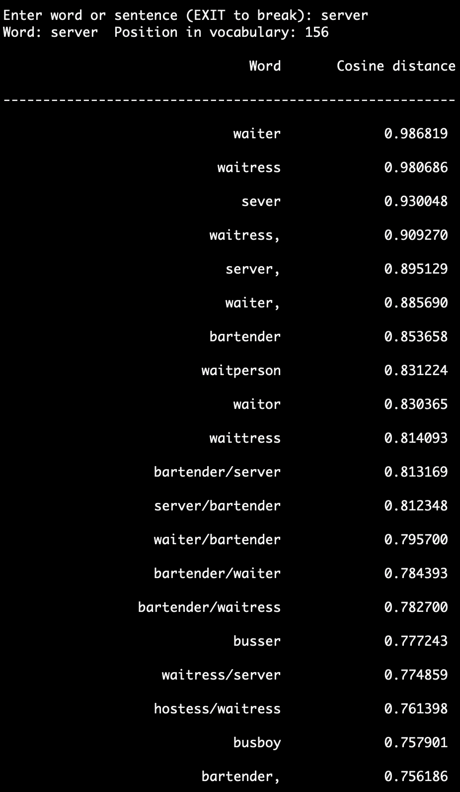
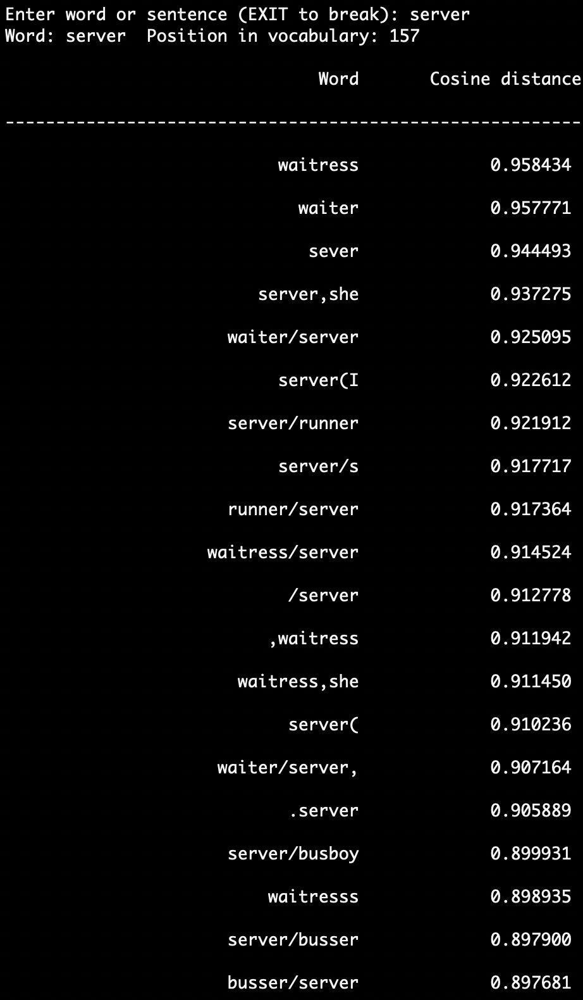
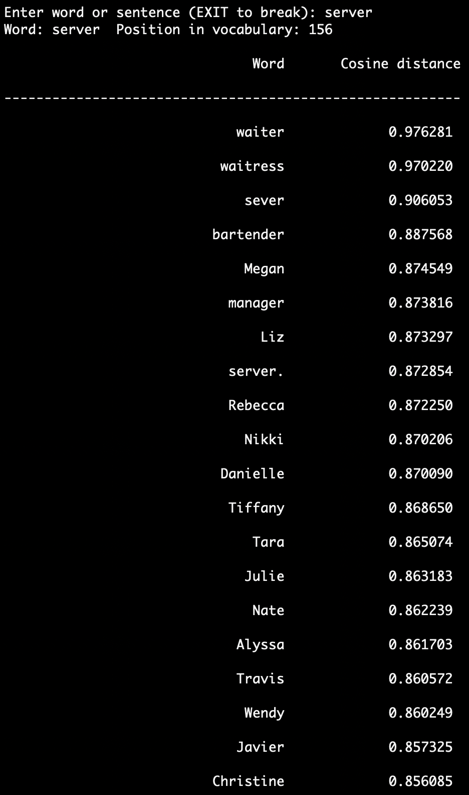
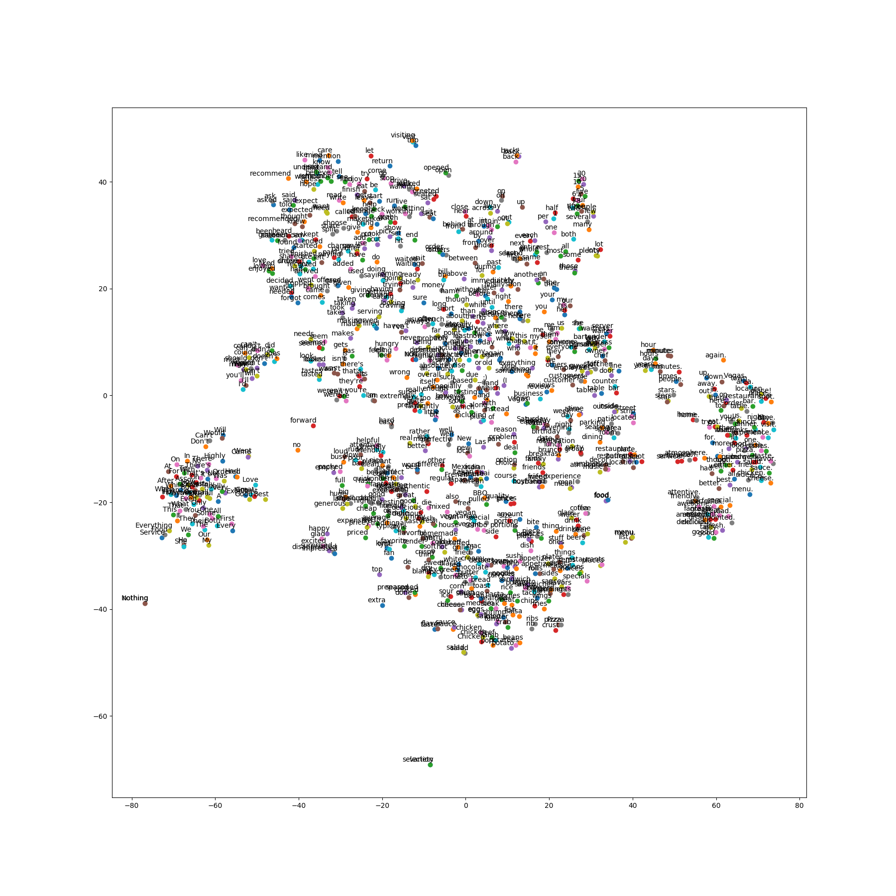
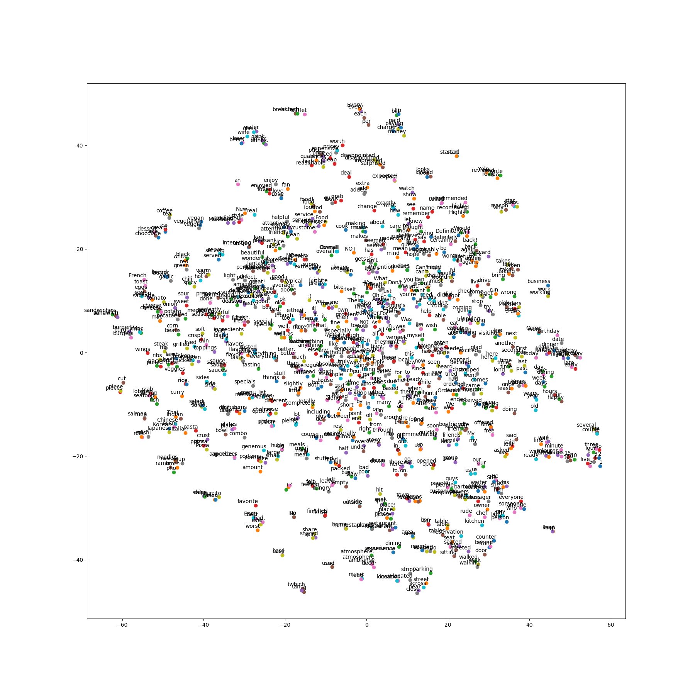
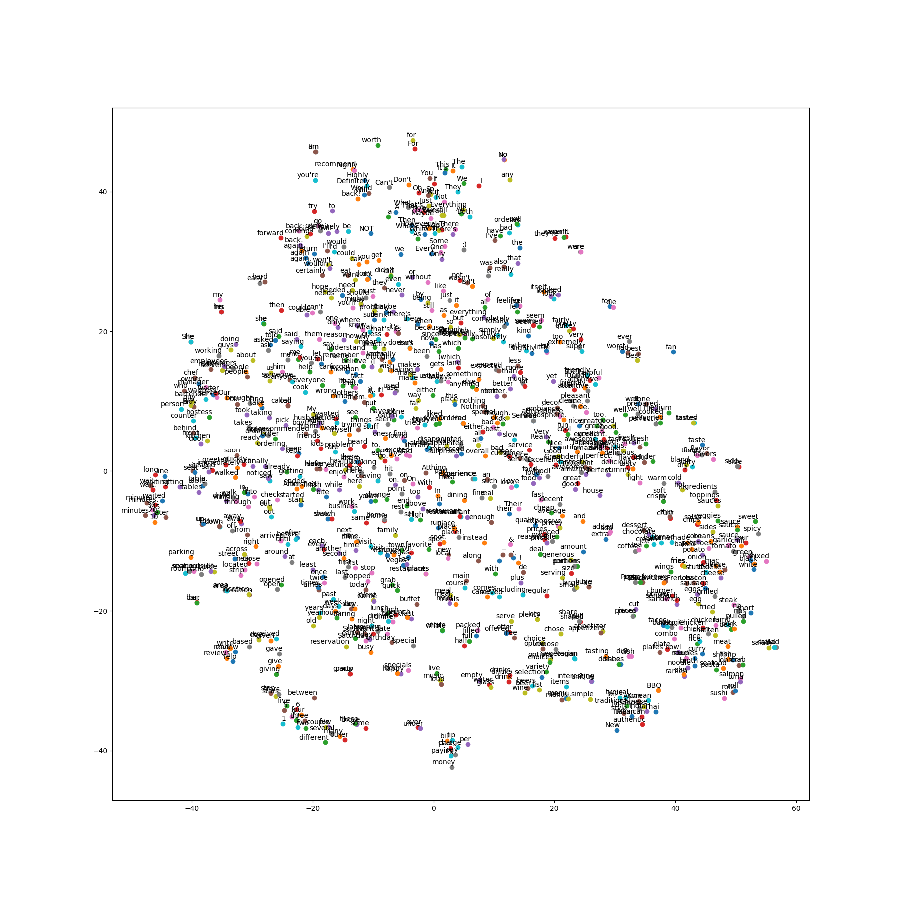

# Learning Word Vectors

- Input file format:
    ```
    sentence 1
    sentence 2
    ...
    sentence n
    ```
- Output file format:
    ```
    #vocab_size_V #embbeding_size_d
    word_1 embedding_value_1 ... embedding_value_d
    word_2 embedding_value_1 ... embedding_value_d
    ...
    word_V embedding_value_1 ... embedding_value_d
    ```
## [Word2vec](https://papers.nips.cc/paper/5021-distributed-representations-of-words-and-phrases-and-their-compositionality.pdf)
- Install *gensim* package: ```conda install -c conda-forge gensim```
- Run:  
    ```
    python learnw2v.py --tr_file /media/data/restaurants/yelp_dataset/processed/extracted_rev/yelp_data_rev.txt --emb_file ./results/w2v_yelp100.vec.txt
    ```
Where:
  + tr_file: the unlabeled training data in line-by-line format
  + emb_file: the saved word vector filename

## [Fasttext](https://fasttext.cc/)
- Download the source code at [this github](https://github.com/facebookresearch/fastText/)
- Download and Build this source:
    ```bash
    bash buildft.sh
    ```
- Run:  
    ```
    python learnfasttext.py --tr_file /media/data/restaurants/yelp_dataset/processed/extracted_rev/yelp_data_rev.txt --emb_file ./results/ft_yelp100.vec
    ```
Where:
  + tr_file: the unlabeled training data in line-by-line format
  + emb_file: the saved word vector filename

## [Glove](https://nlp.stanford.edu/projects/glove/)
- Download the source code at [this github](https://github.com/stanfordnlp/GloVe)
- Download and Build this source:
    ```bash
    bash buildglove.sh
    ```
- Run:  
    ```
    python learnglove.py --tr_file /media/data/restaurants/yelp_dataset/processed/extracted_rev/yelp_data_rev.txt --emb_file ./results/glove_yelp100.vec
    ```
Where:
  + tr_file: the unlabeled training data in line-by-line format
  + emb_file: the saved word vector filename

## Plot word vectors
- Run:  
    ```
    python plotembs.py --emb_file ./results/w2v_yelp100.vec --plot_file ./figs/w2v_yelp100.png
    ```
Where:
  + emb_file: the saved word vector filename
  + plot_file: the saved figure
  
## Cosine Similarity to Measure the Most Similar Embeddings
- Run:     
    ```
    python simembs.py --emb_file ./results/w2v_yelp100.vec.txt --N 20
    ```
Where:
  + emb_file: the saved word vector filename
  + N: Number of compared words

 ## Illustration
 ### Neareast neighbor words with **_server_**:
 
 #### word2vec:  
 
 
 #### fasttext:  
 
 
 #### glove:  
 
 
 ### 2-D figures of 1000 random words 
 
 #### word2vec:  
 
 
 #### fasttext:  
 
 
 #### glove:  
 

